# RetailNext Maven

RetailNext Maven is an AI retail intelligence prototype built on the OpenAI outfit-assistant cookbook. It connects three business moments:

1. **Style** understands a customer request or image and creates a grounded product edit.
2. **Fulfil** verifies inventory across three stores and provides an associate-ready route.
3. **Grow** converts fulfilled, partial and missed searches into buying and store actions.

The product is designed around a simple trust boundary: OpenAI models interpret intent, select tools and synthesize actions; RetailNext systems remain authoritative for products, prices, sizes, inventory and store location.

## Why It Exists

RetailNext customers are shopping for time-sensitive events but report difficulty finding current styles and specific products in stores. Maven addresses:

- lost conversion from weak product discovery
- poor reviews caused by unavailable or hard-to-find stock
- fragmented inventory across a store network
- demand signals that never reach merchandising teams

The original cookbook demonstrates multimodal outfit recommendation with retrieval. Maven extends that pattern into a closed retail loop from customer intent to fulfilment and commercial learning.

## Architecture

```mermaid
flowchart LR
    A[Customer text or photo] --> B[Structured intent extraction]
    B --> C[Hybrid catalogue retrieval]
    C --> D[Suitability guardrail]
    D --> E[Inventory and location tool]
    E --> F[Style and Fulfil experience]
    F --> G[Server-side demand log]
    G --> H[Model-selected analytics tools]
    H --> I[Grounded executive action]
```



### AI-Inferred Facts

- occasion and requested garment types
- colour and style preferences
- gender, size, budget and urgency

### System-Verified Facts

- product identity and catalogue attributes
- price and available sizes
- store inventory and pickup availability
- floor, department, aisle and bay

### Business-Calculated Facts

- hybrid relevance score
- availability-aware ranking
- guardrail acceptance
- missed revenue and opportunity priority

## Maven Live

Maven Live is an unambiguously dynamic path:

1. A configurable multimodal OpenAI model extracts a strict `InputIntent` schema.
2. The intent becomes a text query embedded with `text-embedding-3-large`.
3. The query embedding is compared with the cookbook's precomputed product embeddings.
4. Dense similarity is blended with enriched catalogue-text similarity.
5. A schema-constrained AI guardrail checks style, occasion, size and budget.
6. OpenAI tool calling requests inventory and location facts from local RetailNext functions.
7. Results are ranked by relevance, local fulfilment, nearby fulfilment and commercial priority.

An uploaded photo is used for multimodal intent extraction. Retrieval is then text-embedding based; this prototype does not claim direct image-to-image similarity. Photo mode preserves a known catalogue image as the verified style anchor, expands the intent into relevant complete-the-look categories, and checks live inventory before presenting complementary products such as footwear, hosiery, trousers or ties.

Selecting a story in Maven Live uses only the story prompt. Curated product IDs are never substituted into Live retrieval.

## Simulated Data

Simulated Data is the deterministic presentation and fallback path. It:

- runs without an API key or network
- keeps curated candidates for the three repeatable demo stories
- uses deterministic intent parsing, sparse cosine retrieval and policy guardrails
- uses the same inventory, ranking, demand logging and UI contracts as Maven Live

If a Live call fails or the key is unavailable, the application visibly returns the deterministic result and identifies the fallback.

## Three Demo Stories

| Story | Business scenario | Expected outcome |
|---|---|---|
| Instant Win | Complete wedding outfit | Four matching pieces at RetailNext Oak Street |
| Network Save | Interview stock split across stores | Local items plus a nearby-store option |
| Growth Signal | Plus-size winter formalwear unavailable | Unmet demand logged for Grow |

These stories are deterministic regression scenarios, not evidence that the freeform product is hardcoded.

## Grow Tool Loop

In Maven Live, the model receives an executive question and chooses relevant tools from:

- `analyze_customer_intents`
- `inspect_inventory_gaps`
- `summarize_substitution_trends`
- `inspect_store_location_failures`
- `compare_competitor_signal`
- `recommend_business_actions`

The application executes each selected tool over trusted demand and inventory data, returns the output to the model, and then requests a schema-constrained executive brief.

Governance policy guarantees the core intent and action tools even if the model omits them. Revenue ranking remains deterministic so an unsupported narrative cannot replace the largest grounded opportunity.

## Persistence

Demand records are stored server-side by an anonymous browser session ID and reloaded after browser refresh. Reset clears both client state and the server-side session.

The included adapter is an in-memory prototype store. A production deployment would replace it with RetailNext's event platform, database or warehouse while preserving the same functions.

## Observability

Each recommendation includes:

- request ID and start time
- total latency
- selected models
- retrieval strategy and query
- candidate and retrieval evidence
- inventory tool input/output
- guardrail decisions
- fact provenance

Grow records which tools were selected by the model, guaranteed by policy or run in deterministic demo mode.

## Evaluation

Start the application, then run:

```bash
npm run eval
```

The deterministic suite checks:

- complete local fulfilment
- distributed inventory
- genuine unmet demand
- arbitrary freeform retrieval
- budget guardrail compliance
- correct largest-miss ranking
- image upload rejection
- server-side persistence and reset

To include paid Maven Live checks:

```bash
npm run eval:live
```

Live evaluations verify that story prompts do not activate curated candidates, a black dress returns an in-stock style anchor with complementary heels and hosiery, and the blue formal shirt remains in stock while returning trousers, formal shoes and a tie.

The machine-readable report is also available from:

```text
GET /api/evals
GET /api/evals?live=1
```

## Data

Catalogue:

```text
data/sample_clothes/sample_styles.csv
```

Precomputed embeddings:

```text
data/sample_clothes/sample_styles_with_embeddings.csv
```

Product images:

```text
public/sample_clothes/sample_images/{productId}.jpg
```

Cookbook rows are enriched with prototype retail fields including price, sizes, occasion tags, style tags, inventory health and commercial priority.

## Run Locally

```bash
npm install
npm run dev
```

Open [http://localhost:3000](http://localhost:3000).

### Environment

Create `.env.local`:

```bash
OPENAI_API_KEY=your_key_here
OPENAI_TEXT_MODEL=gpt-5.4-mini
OPENAI_VISION_MODEL=gpt-5.4-mini
OPENAI_EMBEDDING_MODEL=text-embedding-3-large
```

Model defaults are centralized in `src/lib/openai/models.ts` and can be changed without editing pipeline code.

The API key is used only in server-side route handlers. No `NEXT_PUBLIC_OPENAI_API_KEY` is used.

## API Routes

| Route | Purpose |
|---|---|
| `POST /api/recommend` | Intent, retrieval, inventory, guardrail and ranking |
| `POST /api/trend-to-rack` | Model-selected Grow analysis and executive synthesis |
| `GET /api/demand` | Restore session demand records |
| `DELETE /api/demand` | Reset session demand records |
| `GET /api/evals` | Run deterministic evaluation suite |
| `GET /api/retrieval-coverage` | Inspect broader query coverage |

## Verification

```bash
npm run check
npm run build
git diff --check
```

## Production Path

For production, replace the local adapters with:

- RetailNext product information and pricing APIs
- real-time inventory and order-management systems
- store planogram or indoor-location services
- durable demand-event storage
- identity and role-based access
- offline and online evaluation datasets
- latency, cost, quality and safety monitoring

Direct visual product embeddings could be added as a second-stage ranker. They are intentionally excluded from this prototype so its current photo-search behaviour remains technically accurate.
